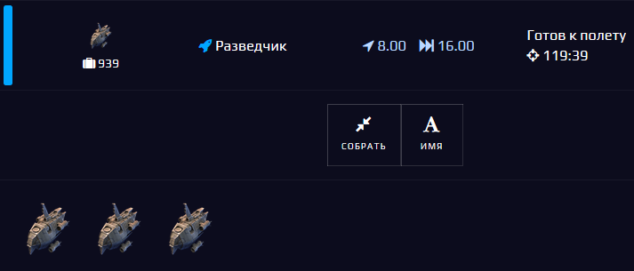
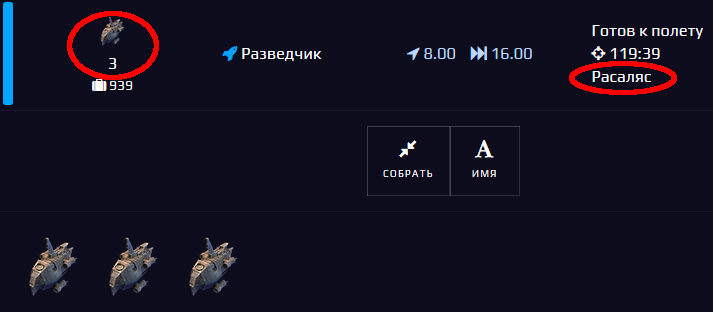
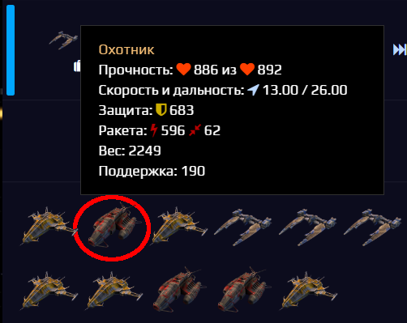
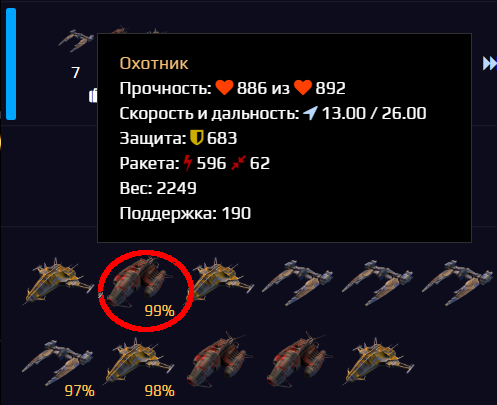

# Spacom.Addons.Fleets.Show
***Отображение дополнительной информации для флотов***

## Основные возможности:
+ Отображение количества однотипных кораблей в составе флота (работает для флотов на карте)
+ Отображение названия системы, в которой находится флот, после её координат (работает для флотов на карте и во вкладках флотов)
+ Настраиваемое отображение остатка прочности кораблей (по умолчанию в игре отображается остаток прочности только для кораблей с прочностью менее 90%); при установке коэффициента `remainingHpRatio` равным единице - будет отображаться остаток прочности для кораблей с прочностью менее 100%, при 0.95 - менее 95% и т. д.

## Пример работы
|Без скрипта|Со скриптом|
|---|---|
|||
|||

## Настройки
Включить или выключить отображение дополнительной информации по флотам можно, изменив настройки в тексте скрипта:
```js
OPT: {
      showShipsCount: true, // <- true - показывать кол-во кораблей, false - нет
      showSystemName: true, // <- true - показывать название системы, false - нет
      showShipsHP: {
        enable: true, // <- true - применить коэффициент остатка прочности, false - нет
        remainingHpRatio: 1, //0.9 (< 90%): стандартное значение, 1: < 100%
      },
    }
```
