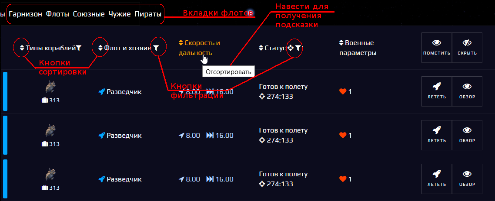
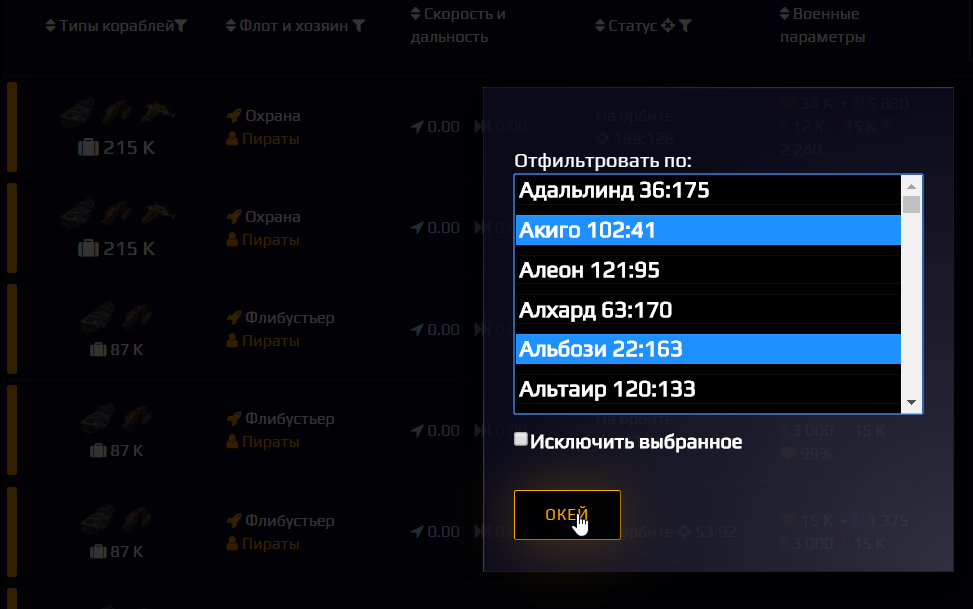

# Spacom.Addons.Fleets.Sort
***Фильтрация и сортировка флотов***

## Основные возможности
+ Разделение вкладок флотов на:
    - *Гарнизон* (свои гарнизоны)
    - *Флоты* (свои флоты, за исключением гарнизонов)
    - *Союзные* (все союзные флоты, включая союзные гарнизоны)
    - *Чужие* (все не-союзные флоты и гарнизоны, за исключением пиратских)
    - *Пираты* (пиратские флоты)
+ Сортировка флотов по различным параметрам (порядок сортировки сохраняется при переключении вкладок флотов):
    - *Типы кораблей* - сортировка происходит по названию иконок кораблей, содержащихся во флоте
    - *Флот и хозяин* - сортирует по имени владельца флота, затем - по названию флотов
    - *Скорость и дальность* - сортировка по скорости и дальности прыжка
    - *Статус* - сортировка по статусу ("на орбите", "в полёте", "готовится к прыжку", "готов к разведке" и т. д.)
    - *Военные параметры* - сортировка по количеству очков прочности
+ Фильтрация флотов по различным параметрам, с возможностью выбора нескольких значений для фильтрации и исключения отфильтрованного (применённые фильтры сохраняются при переключении вкладок флотов):
    - *Типы кораблей* - фильтр по названию иконок кораблей
    - *Флот и хозяин* - фильтр по имени владельца флота, фильтр по названию флота
    - *Статус* - фильтр по системе нахождения флота (название/координаты), фильтр по статусу (кол-во ходов в полёте, 0 - флот не в полёте)
    

## Пример использования фильтрации
+ *Фильтрация по названиям систем* - будут показаны флоты из соответствующей вкладки (в примере - Пираты), расположенные **только в выбранных** системах (Акиго, Альбози)

При выборе опции *Исключить выбранное* будут показаны флоты, расположенные во всех системах, **кроме выбранных**.
