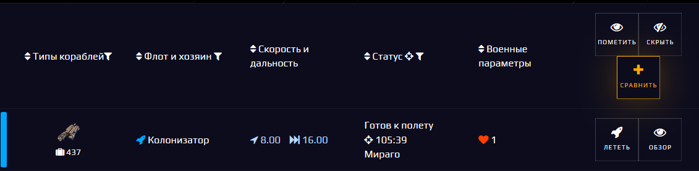
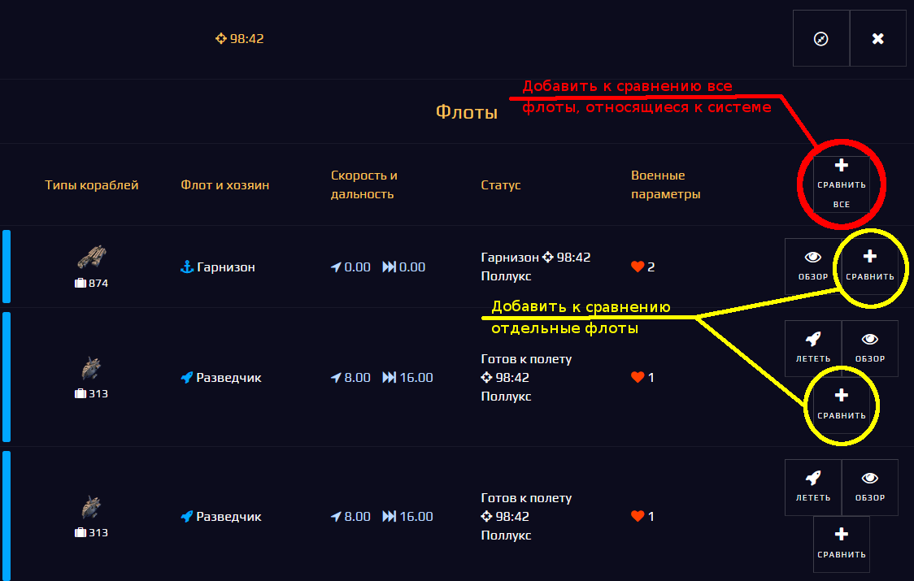
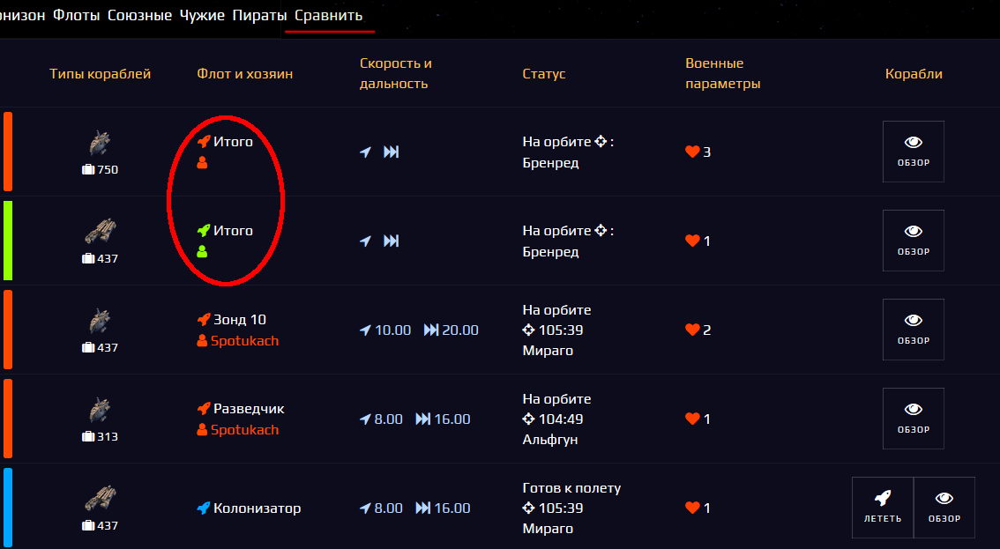

# Spacom.Addons.Fleets.Summary
***Сравнение флотов***

## Порядок работы:
+ Добавить требуемые флоты к сравнению, для этого:
    - [Отфильтровать](./fleets-sort.md) во вкладке флоты, которые необходимо сравнить, пользуясь соответствующими вкладками флотов (к сравнению будут добавлены все флоты из текущей вкладки, оставшиеся после фильтрации)
    - Или выбрать требуемые флоты на карте, щелкнув на систему или отдельный флот (при выборе системы - можно добавить как отдельные флоты, так и все, относящиеся к ней)
+ После нажатия кнопки "+ сравнить" или "+ сравнить все", соответствующие флоты будут добавлены к сравнению, на панели флотов станет активной новая вкладка "Сравнить"
+ При переключении на вкладку "Сравнить" показатели всъ добавленных к сравнению флотов будут просуммированы в соответствии со следующими правилами:
    - Свои флоты, флоты из своих гарнизонов и союзные флоты суммируются в один итог
    - Флоты, состав которых неизвестен (союзные и чужие гарнизоны) в суммировании не участвуют и будут исключены из сравнения автоматически
    - Все чужие флоты, включая пиратов, суммируются в общий итог
+ Возможно добавить к сравнению дополнительные флоты (переключаясь в другие вкладки флотов или с карты), после переключения обратно на вкладку "Сравнить", итоги будут автоматически пересчитаны
+ Для очистки сравнения - повторно щелкнуть на вкладке "Сравнить"
+ По умолчанию итоговые показатели выводятся наверху списка сравниваемых флотов, изменить это поведение можно в настройках скрипта, переключив опцию `showSummaryFleetsOnTop` с `true` на `false`
    ```js
    OPT: {
          showSummaryFleetsOnTop: true, //<-- заменить здесь (true - итоги сверху, false - итоги внизу)
          summaryFleetName: 'Итого',
        }
    ```

## Пример работы сравнения
+ #### Добавление флотов к сравнению с использованием вкладок флотов
    - Добавление к сравнению своих флотов
    
    - Добавление к сравнению чужих флотов
    
+ #### Добавление флотов к сравнению с карты
    - Выбрать на карте систему или отдельный флот, добавить требуемые флоты (все или нужные по отдельности)
    
+ #### Результаты сравнения
(для итоговых флотов в качестве системы пребывания выводится случайная система без координат)
