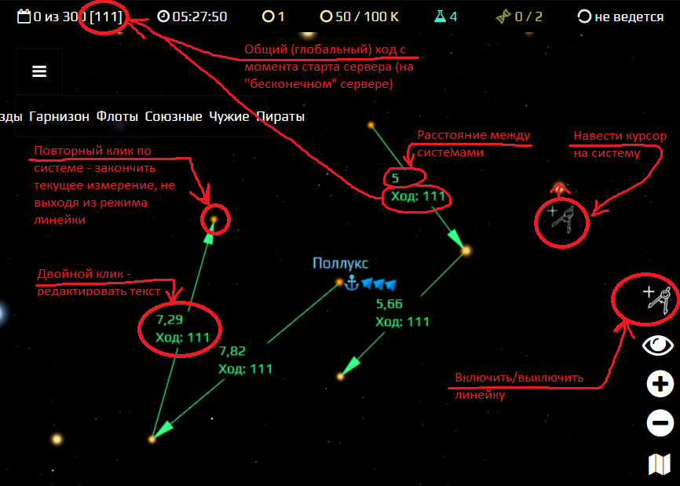

# Spacom.Addons.Map.Ruler
***Линейка для карты - бета-версия***

## Порядок работы:
+ Запуск режима измерений - нажать на иконку линейки, при наведении на системы курсор изменит вид на перекрестье
+ Для начала нового измерения - нажать на первую точку (систему)
+ Для продолжения измерений - последовательно нажимать на следующие точки (системы)
+ Для завершения текущего измерения - повторно нажать на последнюю точку (систему)
+ Выход из режима измерений - повторно нажать на иконку линейки или нажать клавишу Escape
+ Линии с измерениями остаются на карте до перезагрузки страницы
+ По умолчанию на линию наносится редактируемый (по двойному щелчку) текст с измеренным расстоянием и номером текущего хода. Нанесение номера хода можно отключить, заменив в начале скрипта `true` на `false`
    ```js
    const SETTINGS = {
      COLOR: {
        default: '#37ff87',
      },
      DASH: {
        isDashed: false,
        pattern: [5, 20, 20, 5],
      },
      TEXT: {
        addTurn: true, //<-- заменить здесь (true - добавлять номер хода, false - нет)
      },
    };
    ```

## Пример работы линейки
