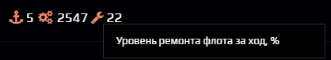
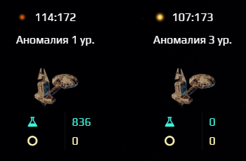
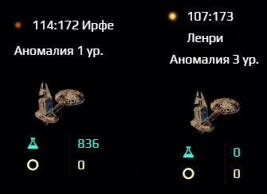

# Spacom.Addons.Stars.StateView
***Отображение дополнительной информации на вкладке "Планеты"***

## Основные возможности:
+ Отображение уровня ремонта (суммарный уровень верфей системы) рядом с информацией о верфях
+ Вывод названия системы, в которой расположена орбитальная станция, изучающая аномалию

## Пример работы
|Без скрипта|Со скриптом|
|---|---|
|||
|||

## Настройки
Включить или выключить отображение дополнительной информации можно, изменив настройки в тексте скрипта:
```js
OPT: {
      showRepairPercent: true, // <- показывать уровень ремонта (false - нет)
      showStationSystemName: true, // <- показывать название системы (false - нет)
    }
```