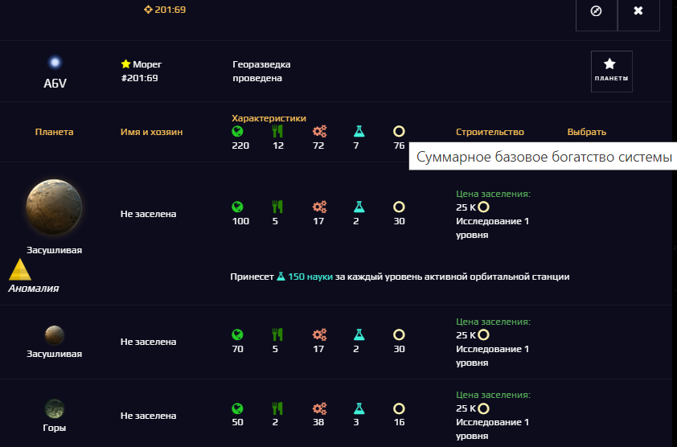

# Spacom.Addons.Stars.SystemView
***Отображение дополнительной информации о системе на карте***

## Основные возможности:
+ Вывод суммарных характеристик системы (для разведанных незаселённых систем) - сумма соответствующих характеристик всех планет системы
+ Отображение уровня ремонта (суммарный уровень верфей в системе, для своих систем) рядом с информацией о гарнизоне и уровне защиты системы

## Пример работы
|Без скрипта|Со скриптом|
|---|---|
|||
|||

## Настройки
Включить или выключить отображение дополнительной информации можно, изменив настройки в тексте скрипта:
```js
OPT: {
      showSystemStats: true, // <- выводить суммарные показатели планет системы (false - не выводить)
      showSystemRepairLevel: true, // <- показывать уровень ремонта в системе (false - не показывать)
    }
```